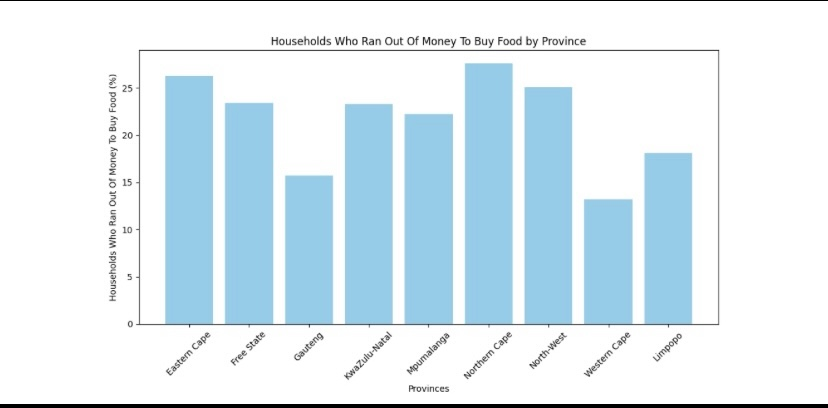
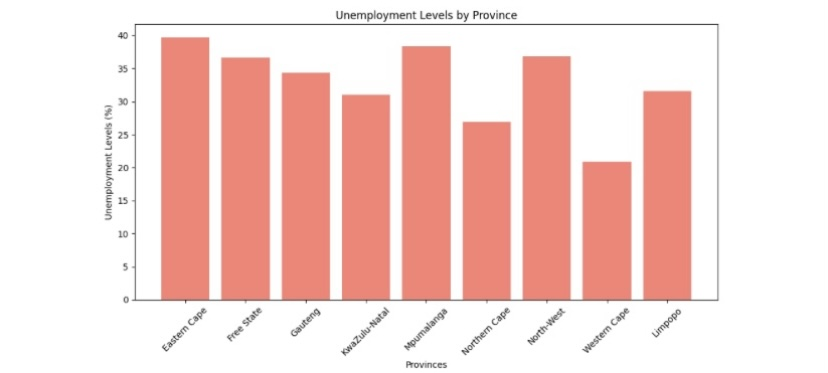
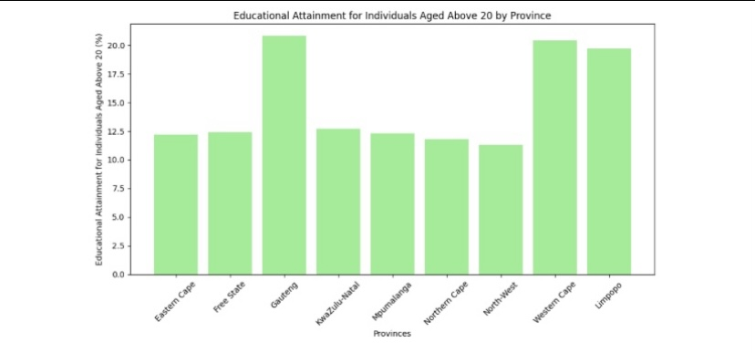

# South Africa Socio-Economic Analysis

## Overview
This project analyzes key socio-economic indicators across South Africa's nine provinces, focusing on food security, unemployment, and educational attainment for individuals aged 20 and above. The goal was to identify which provinces face the greatest socio-economic challenges and explore possible contributing factors.

## Tools & Libraries
- Python
- Pandas (data cleaning & aggregation)
- Matplotlib (data visualization)

---

## Findings

### 1. Households That Ran Out of Money to Buy Food

**Highest: Northern Cape (27.6%)**
The Northern Cape is largely rural and sparsely populated, with limited economic opportunity and heavy reliance on agriculture — factors that increase vulnerability to food insecurity, especially during economic downturns.

### 2. Unemployment Levels

**Highest: Eastern Cape (39.7%)**
The Eastern Cape has experienced long-term industrial decline and limited private investment, contributing to persistently high unemployment across the province.

### 3. Educational Attainment (Individuals Aged 20+)

**Highest: Gauteng (20.8%)**
As South Africa's economic hub, Gauteng offers greater access to universities and skilled employment, drawing educated individuals from other provinces.

---

## Summary
| Indicator | Highest Province | Value |
|---|---|---|
| Households that ran out of food money | Northern Cape | 27.6% |
| Unemployment | Eastern Cape | 39.7% |
| Educational attainment (20+) | Gauteng | 20.8% |

These results highlight a broader pattern in South Africa: rural provinces tend to face greater food insecurity and job scarcity, while urban economic hubs like Gauteng show stronger educational outcomes — reflecting long-standing regional disparities in infrastructure, investment, and access to opportunity.

### Project Files
- **Analysis Document**: [ [Analysis.docx](https://github.com/user-attachments/files/17268957/Analysis.docx)
]
